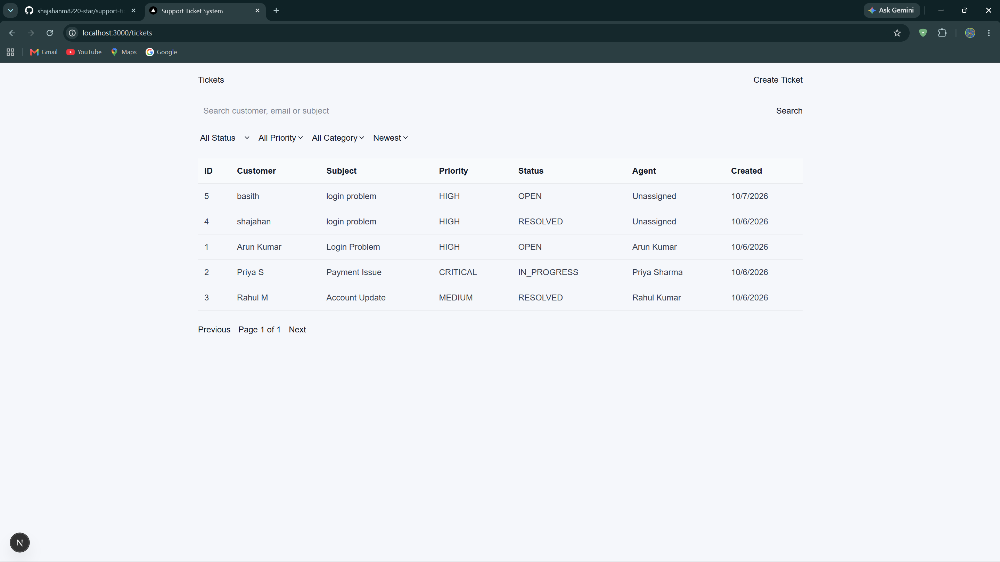
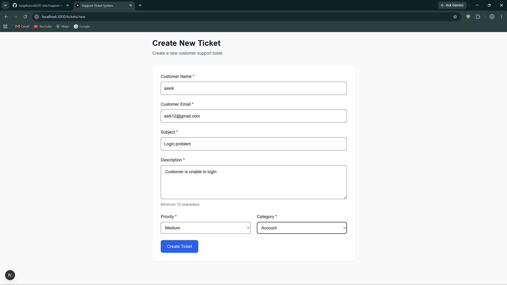
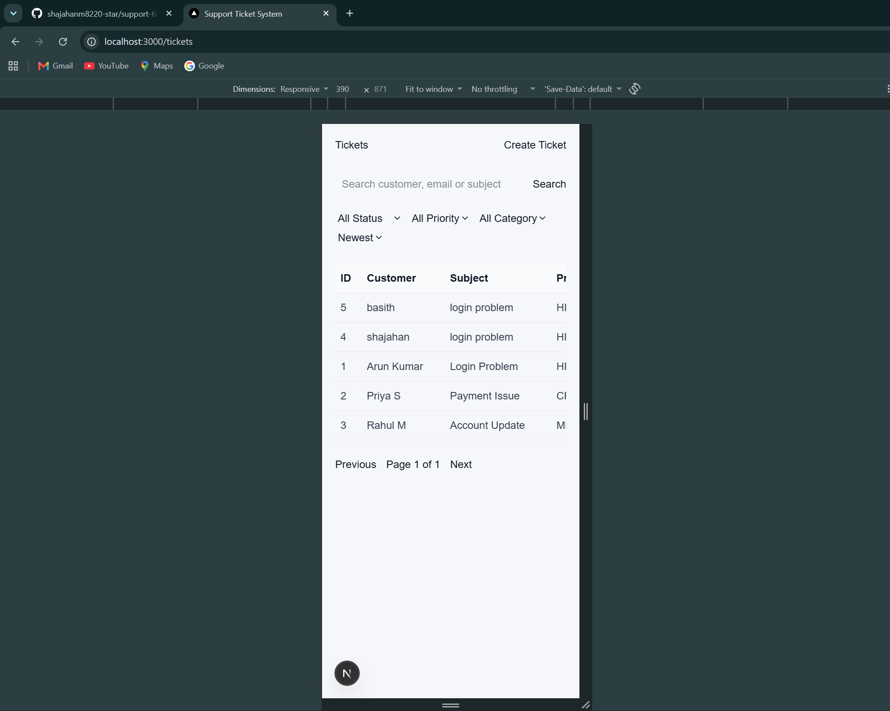

# Support Ticket Management System

## Overview

The Support Ticket Management System is a full-stack web application designed to manage customer support tickets in one centralized system.

The application allows users to create, view, search, filter, sort, and manage support tickets. It provides a simple interface for support teams to track customer issues, ticket status, priority, categories, assigned agents, and ticket creation dates.

The project is divided into a frontend application, backend API, and MySQL database.

## Features

* Create new support tickets
* View all support tickets
* View individual ticket details
* Search tickets by customer, email, or subject
* Filter tickets by status
* Filter tickets by priority
* Filter tickets by category
* Sort tickets
* Pagination for ticket listing
* Customer management
* Agent assignment
* Responsive user interface
* REST API based backend
* MySQL database integration
* Environment variables for sensitive configuration
* Git/GitHub version control

## Architecture

The application follows a simple three-layer full-stack architecture:

```text
+----------------------+
|      Frontend        |
|     Next.js + TS     |
+----------+-----------+
           |
           | HTTP / REST API
           v
+----------------------+
|       Backend        |
|    Node.js + Express |
+----------+-----------+
           |
           | SQL
           v
+----------------------+
|       Database       |
|        MySQL         |
+----------------------+
```

### Request Flow

```text
User
  |
  v
Next.js Frontend
  |
  v
Express REST API
  |
  v
MySQL Database
  |
  v
API Response
  |
  v
Frontend UI
```

## Technology Stack

### Frontend

* Next.js
* React
* TypeScript
* HTML
* CSS
* REST API integration

### Backend

* Node.js
* Express.js
* JavaScript / TypeScript
* REST APIs

### Database

* MySQL

### Development Tools

* Visual Studio Code
* Git
* GitHub
* npm
* PowerShell

## Project Structure

```text
support-ticket-system/
│
├── backend/
│   ├── src/
│   ├── package.json
│   └── ...
│
├── frontend/
│   ├── app/
│   ├── lib/
│   ├── types/
│   ├── public/
│   ├── package.json
│   └── ...
│
├── .gitignore
└── README.md
```

## Prerequisites

Install the following before running the project:

* Node.js
* npm
* MySQL
* Git
* Visual Studio Code

Verify the installation:

```bash
node --version
npm --version
git --version
```

For MySQL, make sure the MySQL server is running before starting the backend.

## Installation

Clone the repository:

```bash
git clone https://github.com/YOUR_USERNAME/support-ticket-system.git
```

Move into the project:

```bash
cd support-ticket-system
```

### Install Backend Dependencies

```bash
cd backend
npm install
```

### Install Frontend Dependencies

Open another terminal or return to the project root:

```bash
cd ../frontend
npm install
```

## Environment Variables

Create environment files locally for configuration values.

Example:

```env
DB_HOST=localhost
DB_USER=your_database_user
DB_PASSWORD=your_database_password
DB_NAME=support_ticket_system
DB_PORT=3306
```

Frontend environment variables can be configured according to the API configuration used by the application.

### Important

Do not commit sensitive information such as:

* Database passwords
* API keys
* Access tokens
* Secret keys
* Private credentials

The project uses `.gitignore` to prevent environment files from being committed.

## Database Setup

Make sure MySQL is installed and running.

Create the database:

```sql
CREATE DATABASE support_ticket_system;
```

Select the database:

```sql
USE support_ticket_system;
```

Create the required tables according to the project's database schema.

The main application data includes entities such as:

* Customers
* Tickets
* Agents

After creating the database, configure the backend environment variables with the correct MySQL connection details.

## Running Backend

Open a terminal:

```bash
cd backend
```

Install dependencies if required:

```bash
npm install
```

Start the backend:

```bash
npm run dev
```

The backend API will run on the port configured in the backend application.

Example:

```text
http://localhost:5000
```

Use the actual port configured in your project.

## Running Frontend

Open a new terminal:

```bash
cd frontend
```

Install dependencies if required:

```bash
npm install
```

Start the Next.js development server:

```bash
npm run dev
```

The frontend application can be opened at:

```text
http://localhost:3000
```

The tickets page is available at:

```text
http://localhost:3000/tickets
```

## API Documentation

The backend exposes REST APIs for application operations such as customer and ticket management.

Typical operations include:

```text
GET    /tickets
GET    /tickets/:id
POST   /tickets
PUT    /tickets/:id
DELETE /tickets/:id
```

Customer-related APIs may include:

```text
GET    /customers
POST   /customers
GET    /customers/:id
```

Use the actual API routes implemented in the backend source code when testing or extending the application.

API requests are sent from the Next.js frontend to the Express backend.

## Screenshots

Add screenshots of the working application to demonstrate the implemented features.

Recommended screenshots include:

### Ticket List

Show:

* Tickets table
* Search
* Filters
* Sorting
* Pagination

### Create Ticket

Show the ticket creation form.

### Ticket Details

Show an individual ticket and its details.

### Responsive View

Show the application running on a mobile-sized screen.

Example structure:

```text
screenshots/
├── tickets-list.png
├── create-ticket.png
├── ticket-details.png
└── responsive-mobile.png
```

Then reference the screenshots in this README using:

```markdown






```

## Validation

The application was validated by checking the following:

* Frontend starts successfully
* Backend starts successfully
* Database connection works
* Tickets can be displayed
* Tickets can be created
* Ticket details can be opened
* Search functionality works
* Filtering works
* Sorting works
* Pagination works
* Responsive layout works on desktop
* Responsive layout works on tablet
* Responsive layout works on mobile
* No unnecessary whole-page horizontal overflow is present on mobile
* Environment files are excluded from Git

## Pagination

Pagination is implemented on the tickets listing page to avoid loading all tickets at once.

The frontend sends pagination information to the backend and displays the available pages.

Example:

```text
Previous     Page 1 of 5     Next
```

The user can navigate between pages using the Previous and Next buttons.

Pagination improves usability and provides a better structure when the number of tickets increases.

## Known Limitations

* Authentication and authorization may not be implemented.
* Real-time ticket updates may not be available.
* Advanced reporting and analytics are not included.
* The application currently depends on the configured MySQL database.
* API routes and configuration depend on the local project environment.
* Mobile users may need to horizontally scroll within the ticket table because the table contains multiple columns.
